# Automation of LAMP (Linux, Apache, MySQL, PHP) stack deployment using a Bash Script in Ansible

## Overview
This is an outline on the Provisioning two Ubuntu-based servers, (master and slave), with Vagrant using Bash Script to Automate LAMP (Linux, Apache, MySQL, PHP)stack in Ansible.

## Objective
Automate the provisioning of two Ubuntu-based servers, named “Master” and “Slave”, using Vagrant.

On the Master node, create a bash script to automate the deployment of a LAMP (Linux, Apache, MySQL, PHP) stack.

This script should clone a PHP application from GitHub, install all necessary packages, and configure Apache web server and MySQL. 
Ensure the bash script is reusable and readable.
Using an Ansible playbook:

Execute the bash script on the Slave node and verify that the PHP application is accessible through the VM’s IP address (take screenshot of this as evidence)
Create a cron job to check the server’s uptime every 12 am.


## Steps
i. Created and provisioned two vagrant virtual machines (master and slave). Below is the configuration of their vagrantfiles. The configuration had the ip addresses of my machines and had the host and port numbers,and disabling of the ssh insert key.  

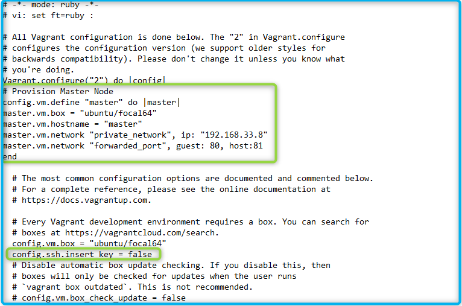

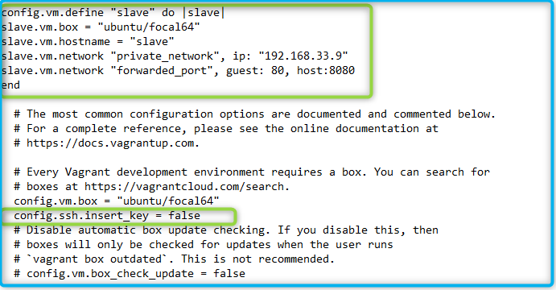


ii. Created public keys in both machines and had them saved interchangeably in each other to enable connection between both machines. i.e the public key of master's machine was saved in the authorized key of the slave machine and vice versa. I generated the key using the command 

```
ssh-keygen

```


iii. Created an inventory file in an Ansible directory I created. Saved my master and slave ip address there so I can connect them to each other. Afterwhich I pinged it to see both IP address connected successfully. I used the command ansible 

```
all -m ping -i inventory
```
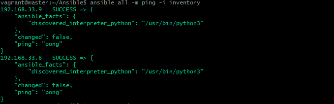

- Here is the content of my inventory file

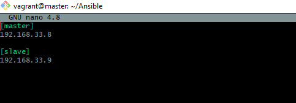


iv. In the same Ansible directory, I created a script called `LAMP.sh`.It is a reusable script to automate the installation and configurations of all dependencies for LAMP (Linux, Apache, MySQL, PHP) stack.

*A reusable script is flexible, adaptable, and easy to use by others in various situations . Reusable scripts save time and effort *

 This is the script below. I have written comments on each line of command to explain what each command is executing.

```
#!/bin/bash

# Define variables for paths and IP address
LARAVEL_DIR="/var/www/html/laravel"
LARAVEL_CONF="/etc/apache2/sites-available/laravel.conf"
VIRTUAL_HOST="192.168.33.9"

# Update all package index and upgrade packages
sudo apt update
sudo apt upgrade -y
echo "Done with upgrade package"

# Update the PHP repository
sudo add-apt-repository -y ppa:ondrej/php
echo "Done with php repo update"

# Install Apache
sudo apt install -y apache2
sudo systemctl enable apache2
echo "Done with Apache installation"

# Install MySQL
sudo debconf-set-selections <<< 'mysql-server mysql-server/root_password password'
sudo debconf-set-selections <<< 'mysql-server mysql-server/root_password_again password'
sudo apt install -y mysql-server
echo "Done with MySQL installation"

# Install PHP 8.2 and 8.3 with necessary extensions
sudo apt install -y php libapache2-mod-php php-mysql php8.2 php8.2-curl php8.2-dom php8.2-xml php8.2-mysql php8.2-sqlite3 php8.3 php8.3-curl php8.3-dom php8.3-xml php8.3-mysql php8.3-sqlite3
echo "Done with PHP 8.2 and 8.3 installation"

# Run MySQL secure installation
expect <<EOF
spawn sudo mysql_secure_installation
expect "Would you like to setup VALIDATE PASSWORD component?"
send "y\r"
expect {
    "Please enter 0 = LOW, 1 = MEDIUM and 2 = STRONG" {
        send "1\r"
        exp_continue
    }
    "Remove anonymous users?" {
        send "y\r"
        exp_continue
    }
    "Disallow root login remotely?" {
        send "n\r"
        exp_continue
    }
    "Remove test database and access to it?" {
        send "y\r"
        exp_continue
    }
    "Reload privilege tables now?" {
        send "y\r"
        exp_continue
    }
}
EOF
echo "Done with MySQL secure installation"

# Restart Apache
sudo systemctl restart apache2
echo "Done with Apache restart"

# Install Git
sudo apt install -y git
echo "Done with Git installation"

# Clone Laravel repository
sudo git clone https://github.com/laravel/laravel $LARAVEL_DIR
echo "Done with cloning Laravel repository"

# Change directory to Laravel folder
cd $LARAVEL_DIR
echo "Changed directory to $LARAVEL_DIR"

# Install Composer
sudo apt install -y composer
echo "Done with installing Composer"

# Upgrade Composer to version 2
sudo php -r "copy('https://getcomposer.org/installer', 'composer-setup.php');"
sudo php -r "if (hash_file('sha384', 'composer-setup.php') === 'dac665fdc30fdd8ec78b38b9800061b4150413ff2e3b6f88543c636f7cd84f6db9189d43a81e5503cda447da73c7e5b6') { echo 'Installer verified'; } else { echo 'Installer corrupt'; unlink('composer-setup.php'); } echo PHP_EOL;"
sudo php composer-setup.php --install-dir /usr/bin --filename composer
echo "Done with upgrading Composer to version 2"

# Use Composer to install dependencies
yes | sudo composer install
echo "Done installing Composer dependencies"

# Copy Laravel configuration file and set permissions
sudo cp .env.example .env
sudo chown www-data:www-data .env
sudo chmod 640 .env
echo "Done copying Laravel configuration file and setting permissions"

# Create virtual host in /etc/apache2/sites-available
sudo tee $LARAVEL_CONF >/dev/null <<EOF
<VirtualHost *:80>
    ServerName $VIRTUAL_HOST
    ServerAlias *
    DocumentRoot $LARAVEL_DIR/public

    <Directory $LARAVEL_DIR>
        AllowOverride All
    </Directory>
</VirtualHost>
EOF
echo "Done creating virtual host in /etc/apache2"

# Generate application key
sudo php artisan key:generate
echo "Done generating application key"

# Run migrations
sudo php artisan migrate --force
echo "Done running migrations"

# Change ownership permissions
sudo chown -R www-data:www-data $LARAVEL_DIR/database/ $LARAVEL_DIR/storage/logs/ $LARAVEL_DIR/storage $LARAVEL_DIR/bootstrap/cache
echo "Done changing ownership permissions"

# Set file permissions
sudo chmod -R 775 $LARAVEL_DIR/database/ $LARAVEL_DIR/storage/logs/ $LARAVEL_DIR/storage
echo "Done setting file permissions"

# Disable default configuration file
sudo a2dissite 000-default.conf
echo "Done disabling default configuration file"

# Enable Laravel configuration file
sudo a2ensite laravel.conf
echo "Done enabling Laravel configuration file"

# Restart Apache
sudo systemctl restart apache2
echo "Done restarting Apache"


uptime > /var/log/uptime.log

```
Here is a snippet of the long codes of commands of the LAMP script.

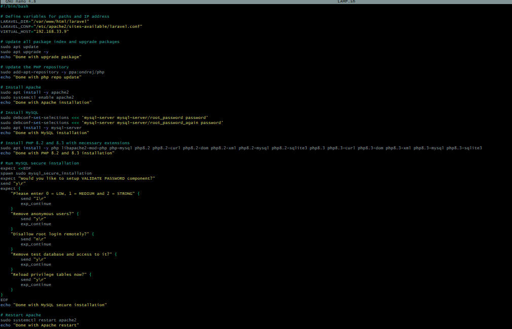


v. I created my playbook and automated my script in it. This was after taking my time to crosscheck step-by-step that each commands where working well and the whole script running on it's own. This is the content of my playbook. Below is my `playbook.yml`. I added comments to explain what each task does.

```
---

- hosts: 192.168.33.9
  become: yes
  tasks:

    # Copy LAMP.sh script to the slave node
    - name: Copy LAMP.sh script to slave node
      copy:
        src: /home/vagrant/Ansible/LAMP.sh
        dest: /home/vagrant/LAMP.sh
        mode: 0755  
        
      # Make the script executable

    # Execute the LAMP.sh script on the slave node
    - name: Execute LAMP.sh script on slave node
      shell: /home/vagrant/LAMP.sh


- name: Create a cron job to check server's uptime every 12 am
  hosts: 192.168.33.9
  become: yes
  tasks:

    # Create an uptime script that logs the server's uptime to a file
    - name: Create the uptime script
      copy:
        content: |

          #!/bin/bash

          # Log the server's uptime to a file
          uptime > /var/log/uptime.log
        dest: /usr/local/bin/check_uptime.sh
        mode: '0755'  # Make the script executable

    # Create a cron job that runs the uptime script every day at 12 am (midnight)

    - name: Create a cron job to check uptime every 12 am
      cron:
        name: Check uptime every 12 am
        job: "/usr/local/bin/check_uptime.sh"
        
        # Run at 12:00 am
        minute: '0'  
        hour: '0'
        state: present

    # Display the contents of the uptime log file
    - name: Display uptime log file
      shell: cat /var/log/uptime.log
      register: uptime_output

    # Display the server's uptime as captured in the uptime log file
    - name: Display the server's uptime
      debug:
        msg: "{{ uptime_output.stdout }}"

    # Task to fetch the content of the PHP application using curl
    - name: Fetch PHP application content using curl
      command: "curl -s http://192.168.33.9"  # Perform a silent HTTP GET request to the target IP address
      register: php_application  # Register the output of the curl command
      ignore_errors: true  # Continue playbook execution even if this task fails

    # Task to display the content fetched from the PHP application
    - name: Display content of PHP application
      debug:
        msg: "PHP Application Content:\n{{ php_application.stdout }}"  # Display the output of the curl command

```

- Here is a snippet of my playbook

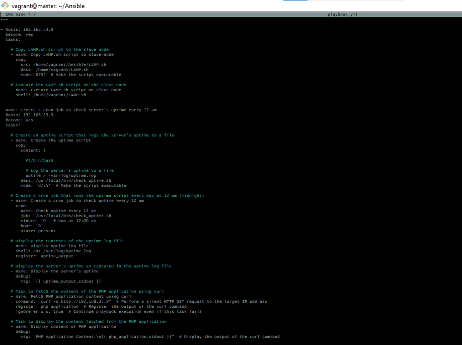

vi.  I created a cron job to check the server’s uptime every 12 am  in my playbook. You can find the task in the playbook above but this is a snippet of it.

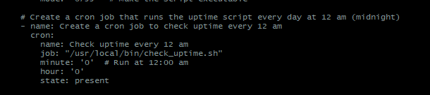

> This is the content of my log file where the server's uptime check is stored. Since my master and my slave is connected, I was able to check this from my slave node. I used the command  `sudo crontab -l` to checkk
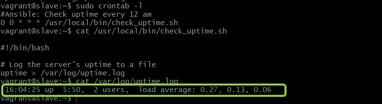


vii. I encountered a couple of errors executing the playbook. Creating the uptime script and display of uptime log file were bringing errors but I was able to fix them by correcting the commands and had my script running again.


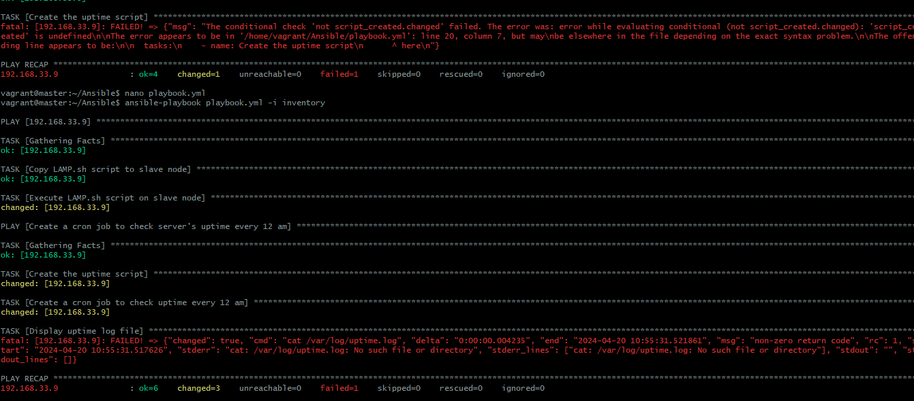

viii. The final output of my script execution went very well and it came out with no errors.I was able execute the bash script on the Slave node and verify that the PHP application is accessible through the VM’s IP address. I have circled the slave IP addresss in the screenshot. 

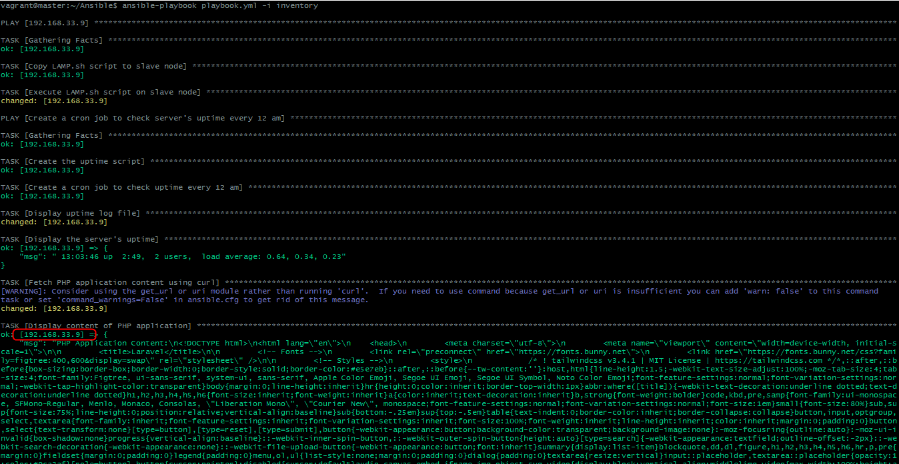

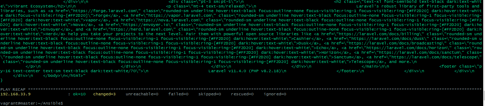

ix. On my web browser,this is the output with the slave IP address.

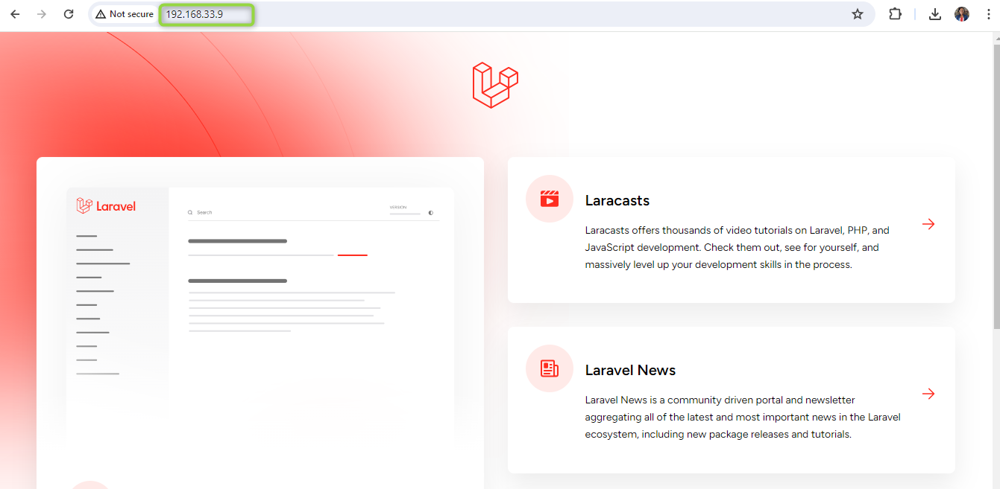

## Conclusion

In summary, one of the effective and dependable method for provisioning and controlling servers has been demonstrated in this project by the automation of the LAMP (Linux, Apache, MySQL, PHP) stack deployment utilizing a Bash script in Ansible. The deployment of the LAMP stack on Ubuntu-based servers is quite fast and less labor-intensive than with manual setup because of the script automation and it is even reusable.

The Bash script can be easily adapted to many environments and use cases due to its reusability, which is attained through defining variables that can be passed as parameters and error handling.

The deployment process was further automated and made uniform and repeatable by integrating the script into an Ansible playbook. In addition to establishing cron jobs to track server uptime and confirming that PHP applications could be accessed, the playbook carried out actions on both the master and slave nodes, giving important information about server performance.

Even though there were a few difficulties along the road, like script errors and log file problems, these could be fixed with thorough debugging and code modifications. The end result showed that the PHP application had been deployed and verified successfully on the slave node's IP address.

All things considered, the project demonstrates how Ansible and Bash scripting can be used to automate intricate deployment procedures. This detailed documentation of the stages and solutions makes it a useful tool for future deployments and projects utilizing the LAMP stack
